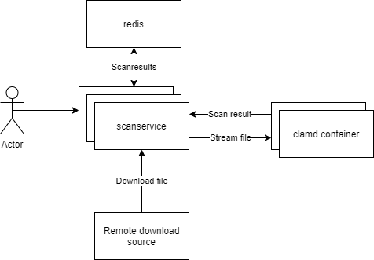

# Clamav-proxy
Enable scalable antivirus scanning powered by clamav!

The service comes as an endpoint you can proxy your web requests for a certain host toward.
The service will then download and scan your files before delivering the data to the client making the download request.

The scan results are stored in redis with an automatic expiry after 24 hours. If a scan result is found in redis the 
download will be immediately streamed to the client instead of being scanned.

## Underlying architecture
The service uses a python web server for incoming requests. It will then:
1. Check for an existing scan result in redis
   If there is a scan result it will:
     - Refuse the request with a 409 for infected files.
     - Stream the file in chunks to the client for
2. Download the requested file in chunks.
3. Send the downloaded file to the clamav container for scanning, which will send a scan result back
4. Store the scan result in redis.
5. 
   - If no virus was found serve the downloaded file
   - If a virus was found abort the request with a http status code 409 (conflicted resource)

